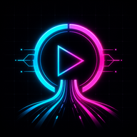
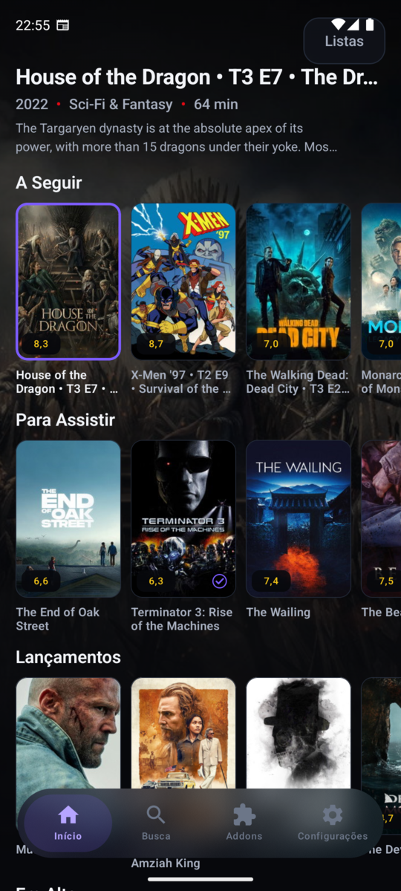
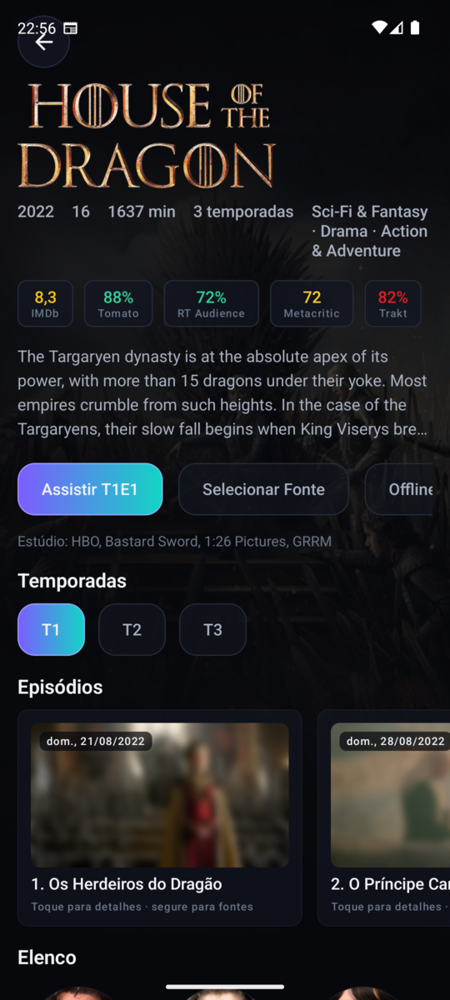
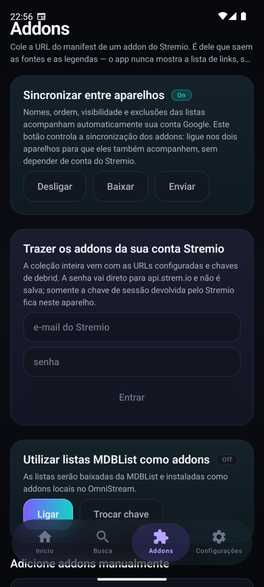
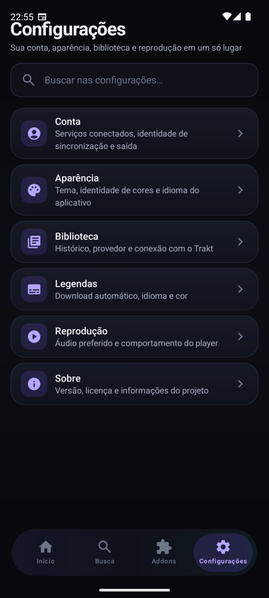

<div align="center">
  
  <h1>OmniStream Mobile</h1>
  <p>
    <strong>Sua biblioteca, suas fontes e seu progresso em uma experiência Android nativa.</strong><br>
    Filmes e séries com uma interface rápida, moderna e feita para toque.
  </p>

  <p>
    
    
    
    
  </p>

  <p>
    <a href="https://github.com/sauliiin/open-stremio-mobile/releases"><strong>Baixar APK</strong></a>
    ·
    <a href="#build-do-código-fonte">Build do código-fonte</a>
    ·
    <a href="LICENSE">Licença</a>
  </p>
</div>

---

## Streaming do seu jeito

O OmniStream organiza sua biblioteca, metadados, avaliações, legendas e progresso em uma única experiência. Conecte seus próprios addons Stremio, use listas MDBList como addons locais e deixe o player escolher automaticamente a melhor fonte disponível.

> [!NOTE]
> O OmniStream não fornece, hospeda ou vende conteúdo. As fontes e os serviços conectados são configurados pelo próprio usuário.

## Interface

<p align="center">
  
  &nbsp;
  
  &nbsp;
  
  &nbsp;
  
</p>

## Destaques

- **Interface touch-first:** navegação inferior flutuante e translúcida, animações sutis, hierarquia clara e layouts próprios para retrato e paisagem.
- **Biblioteca cache-first:** o Room entrega conteúdo imediatamente e os workers atualizam listas, metadados, imagens e progresso em segundo plano.
- **Addons flexíveis:** importe sua conta Stremio, adicione manifests manualmente, sincronize entre aparelhos ou transforme listas MDBList em addons locais.
- **Player resiliente:** Media3/ExoPlayer testa fontes em sequência, faz fallback automático e permite seleção manual quando você quiser.
- **Tudo em um só lugar:** avaliações de múltiplos serviços, temporadas, episódios, elenco, legendas, reprodução offline e integração com Trakt.
- **Identidade personalizável:** temas Normal, Cyberpunk, Netflixy e Primefly, com interface em português, inglês e espanhol.

## Instalação

O OmniStream requer **Android 7.0 (API 24)** ou superior.

1. Abra a página de [releases](https://github.com/sauliiin/open-stremio-mobile/releases).
2. Baixe o APK da arquitetura do seu aparelho ou escolha o `universal` se não souber qual usar.
3. Permita a instalação de apps dessa fonte e instale o APK.

## Build do código-fonte

Você precisa do **JDK 17+**, Android SDK e um `local.properties` apontando para o SDK local.

```bash
./gradlew assembleDebug
./gradlew assembleRelease
```

Os APKs separados por ABI e o APK universal são gerados em `app/build/outputs/apk/`.

<details>
<summary><strong>Configurar Firebase e login Google</strong></summary>

O login usa Firebase Authentication com Google. Para rodar o app com sua própria infraestrutura:

1. Crie um projeto Firebase, ative **Authentication > Google** e cadastre o SHA-1 da chave de assinatura dos builds debug e/ou release.
2. Gere o `google-services.json` do seu projeto e substitua `app/google-services.json`. O arquivo versionado aponta para o projeto do autor e não deve ser usado como backend de terceiros.
3. Crie o Realtime Database e ajuste `FIREBASE_BASE` em `core/network/.../ApiConfig.kt` caso a instância use outra URL.
4. Restrinja cada usuário ao próprio nó nas regras. A chave MDBList fica em `/users/{uid}/profile` e a sincronização de addons em `/users/{uid}/addons`.

</details>

<details>
<summary><strong>Arquitetura</strong></summary>

| Módulo | Responsabilidade |
| --- | --- |
| `:core:model` | Tipos de domínio em Kotlin puro |
| `:core:network` | Retrofit/OkHttp para MDBList, TMDB, OMDb e Stremio |
| `:core:database` | Room como fonte da verdade da interface |
| `:core:data` | Repositórios cache-first, sessão e workers |
| `:core:ui` | Design system em Compose |
| `:player` | Media3/ExoPlayer, buffer, failover, áudio e legendas |
| `:app` | Telas, navegação e grafo de objetos |

O projeto não usa framework de injeção de dependência. O grafo está centralizado no [`DataGraph`](core/data/src/main/kotlin/com/mdblisthub/tv/core/data/DataGraph.kt).

O app também é independente do projeto irmão para Android TV: os dois possuem projetos Gradle e `applicationId` próprios, podendo ser instalados lado a lado.

</details>

<details>
<summary><strong>Player, cache e tarefas em segundo plano</strong></summary>

Ao iniciar uma reprodução, o app consulta os addons instalados em paralelo e encaminha as fontes ao [`PlaybackController`](player/src/main/kotlin/com/mdblisthub/tv/player/PlaybackController.kt). Uma fonte só é considerada válida quando o Media3 chega a `STATE_READY`; falhas avançam automaticamente para a próxima opção.

O Room mantém cards e detalhes em tabelas separadas para que sincronizações grandes não invalidem metadados caros. `ListSyncWorker`, `MetadataWorker`, `ArtworkWorker`, `ResumeSyncWorker` e `CachePruneWorker` mantêm os dados atualizados sem colocar a rede no caminho crítico da interface.

</details>

## Open source

Distribuído sob a licença **GPL-3.0**. Consulte [LICENSE](LICENSE).

A linguagem visual moderna incorpora padrões adaptados do projeto GPL-3.0 [NuvioMobile](https://github.com/NuvioMedia/NuvioMobile), preservando os temas, cores e fluxos próprios do OmniStream. As atribuições estão em [THIRD_PARTY_NOTICES.md](THIRD_PARTY_NOTICES.md).

O APK inclui `player/libs/media3-decoder-ffmpeg-1.11.0.aar`. O FFmpeg incorporado está sujeito às licenças LGPL/GPL, cujas obrigações acompanham qualquer redistribuição do aplicativo.
